# AI驱动的智能工作流程管理系统

一个基于 Vue 3 + TypeScript + Node.js + MySQL 的智能工作流程管理平台，集成 AI 对话、任务管理、流程分析、代码生成、评估可视化与 PDF 报告导出。

## 🚀 项目概览

本平台旨在通过 AI 赋能软件研发与复杂问题解决的全流程。它不仅仅是一个对话机器人，而是一条标准化的**智能生产线**。用户只需通过自然语言描述需求，系统即可引导完成从需求分析、任务拆解、风险识别、方案设计、代码生成到最终评估的完整闭环。

### 关键特性
- **🤖 深度智能对话**：集成 DeepSeek API，支持流式响应、长上下文记忆与多任务并行处理。
- **📋 结构化任务流**：独创的“九步工作法”，将模糊需求转化为可落地的工程方案。
- **🧠 多维思维模型**：内置趋势分析、九宫格系统分析、FOP 分析及多种创新思维模型（第一性原理等）。
- **💻 可执行代码生成**：自动生成项目骨架、核心算法代码及运行验证逻辑，支持多语言（TS/JS/Python/Go/Java）。
- **📊 可视化与报告**：提供四维能力评分雷达图，支持一键导出包含全流程数据的专业 PDF 报告。
- **🔐 企业级安全**：基于 JWT 的身份认证，密码加密存储，完整的权限控制。
- **💾 全量数据追溯**：所有对话、分析记录、方案版本均持久化存储于 MySQL，随时回溯。

## 🏗️ 架构与技术栈

### 前端 (Frontend)
- **核心框架**：Vue 3 (Composition API) + TypeScript
- **构建工具**：Vite 5
- **UI 组件库**：Element Plus
- **可视化**：ECharts 5
- **工具库**：Vue Router 4, Pinia (状态管理), Axios
- **报告生成**：html2canvas + jsPDF, marked (Markdown 渲染)

### 后端 (Backend)
- **运行时**：Node.js
- **Web 框架**：Express
- **数据库**：MySQL 8.0
- **ORM/驱动**：mysql2 (支持 Promise)
- **安全**：jsonwebtoken (JWT), bcrypt (哈希加密), cors

### AI 服务
- **模型接入**：服务端代理转发，兼容 OpenAI 接口格式
- **默认模型**：deepseek-v3 / deepseek-r1

## 🧭 工作流程

系统采用线性的标准化作业流程，确保输出质量的稳定性：

```mermaid
graph LR
    Step1[1.需求收集<br/>Dialog] --> Step2[2.模板生成<br/>Template]
    Step2 --> Step3[3.任务拆解<br/>TaskManager]
    Step3 --> Step4[4.子任务详情<br/>SubTaskDecomposition]
    Step4 --> Step5[5.集成分析<br/>NewIntegration]
    Step5 --> Step6[6.方案对比<br/>Results]
    Step6 --> Step7[7.方法选择<br/>TemplateSelection]
    Step7 --> Step8[8.最终整合<br/>FinalResult]
    Step8 --> Step9[9.可执行实施方案<br/>ExecutablePlan]
    Step9 --> Step10[10.可视化评估<br/>Visualization]
```



## 🧩 核心功能模块详解

### 1. 需求对话 (Dialog)
与 AI 助手进行实时对话。系统会自动记录对话上下文，帮助用户理清模糊需求。支持创建多个独立的对话任务，并在不同任务间无缝切换。

### 2. 模板生成 (Template)
基于对话内容，AI 自动提取并结构化关键要素，包括**应用领域**、**目标受众**、**核心关键词**、**语调风格**及**优化后的提示词**，为后续的深度分析奠定基础。

### 3. 任务管理与拆解 (TaskManager)
- **三维分析**：从“主演化（趋势）”、“主系统（九宫格）”、“主作用（FOP）”三个维度深度剖析任务背景。
- **智能拆解**：AI 将复杂任务自动拆解为 1-5 个具体的子任务，并评估每个子任务的难度与优先级。

### 4. 子任务详情 (SubTaskDecomposition)
展示由 TaskManager 拆解生成的子任务列表。用户可以查看每个子任务的详细描述、难度等级及状态，确认无误后进入集成分析阶段。

### 5. 集成分析 (NewIntegration)
针对拆解出的每个子任务，AI 自动识别潜在的技术难点、依赖关系与风险点（问题清单）。用户可勾选关键问题，系统将针对性地生成初步解决方案。

### 6. 方案生成与对比 (Results)
系统并行生成两套完整的解决方案（方案 A 与 方案 B）。这两套方案通常代表不同的技术路线（如“保守稳健型”vs“激进创新型”），帮助用户开拓视野。

### 7. 方法论选择 (TemplateSelection)
引入创新思维模型（如**第一性原理**、**逆向思维**、**类比思维**等），对比两套方案的优劣，并推荐最适合当前场景的方法论指导后续落地。

### 8. 最终整合 (FinalResult)
综合前序步骤的所有决策与分析，AI 自动生成一份详尽的**最终技术方案文档**，包含项目背景、核心目标、整体架构设计及详细的逻辑流程。

### 9. 可执行实施方案 (ExecutablePlan) 🆕
- **代码生成**：根据用户选定的技术栈（TypeScript/Python/Go 等）和运行环境，生成标准的项目目录结构、核心模块代码骨架。
- **核心验证**：提供关键算法或业务流的具体实现代码，并附带**预期运行结果**与验证逻辑，确保方案不仅理论可行，且具备工程落地性。
- **多粒度支持**：支持生成“骨架结构”、“关键模块”或“近完整实现”不同粒度的代码。

### 10. 可视化评估 (Visualization)
- **多维评分**：AI 从准确性、清晰度、可解释性、创新性四个维度对最终方案进行打分。
- **雷达图展示**：直观展示方案的能力分布。
- **报告导出**：一键生成包含所有阶段内容（对话记录、分析过程、代码片段、评估图表）的专业 PDF 报告，便于汇报与存档。

## ⚙️ 快速开始（Windows）

> 开始前请准备：MySQL 连接信息、JWT 密钥；AI Key 可选（见下方说明）。

### 环境要求
- Node.js ≥ 18（Vite 5 要求）
- npm ≥ 8
- MySQL ≥ 8.0

### 安装
```powershell
# 1. 克隆项目
git clone <repository-url>
cd Yuanchuang_Platform

# 2. 安装前端依赖
npm install

# 3. 安装后端依赖
cd login-backend
npm install
```

### 配置环境变量
- **后端**：在 `login-backend/.env` 文件中配置（如不存在请创建）：
```env
DB_HOST=localhost
DB_USER=root
DB_PASSWORD=your_mysql_password
PORT=3000
JWT_SECRET=your_jwt_secret_key

# AI 模型配置（三选一，建议配置 DEEPSEEK_API_KEY）
DEEPSEEK_API_KEY=your_api_key
# OPENAI_API_KEY=...
# QINIU_OPENAI_KEY=...
```

- **前端**（可选）：在项目根目录 `.env` 文件中配置：
```env
# 仅当你希望由前端直接携带 Key 请求（不推荐生产环境）
VITE_API_KEY=your_deepseek_api_key
```

### 初始化数据库
后端服务启动时会自动检测并创建 `user_system` 数据库及所有必要的数据表。你只需要确保 MySQL 服务已启动且账号密码正确。

### 启动服务
```powershell
# 1. 启动后端（默认端口 3000）
cd login-backend
node server.js

# 2. 启动前端（默认端口 5173）
# 新开一个终端窗口
cd ..
npm run dev
```

访问浏览器：`http://localhost:5173`

## 🗄️ 数据库设计

系统包含以下核心数据表：

| 表名 | 描述 | 关键字段 |
|------|------|----------|
| `users` | 用户表 | username, password |
| `dialog_tasks` | 任务列表 | task_name, is_active |
| `conversations` | 对话记录 | user_question, ai_response |
| `ai_content` | 模板提取内容 | area, audience, prompt |
| `task_manager_content` | 任务分析数据 | plan_tasks, sub_tasks_json |
| `sub_tasks` | 子任务详情 | sub_task_name, difficulty |
| `task_problems` | 问题清单 | problem_description, is_critical |
| `new_integration_analysis` | 集成分析 | selected_issues, ai_solution |
| `results_solutions` | 双方案数据 | solution1_content, solution2_content |
| `template_selection_records` | 方法选择记录 | left_method, right_method |
| `final_result_expanded` | 最终整合方案 | combined_plan |
| `executable_plans` | 可执行代码方案 | plan_text, code_blocks, language |
| `visualization_assessments` | 评分与评估 | radar_data, ai_scores |

## 🔌 核心 API 参考

### 用户与任务
- `POST /api/register` - 用户注册
- `POST /api/login` - 用户登录
- `GET /api/dialog-tasks/:userId` - 获取任务列表
- `POST /api/dialog-tasks` - 创建新任务

### 流程数据管理
- `GET /api/ai-content/:taskName` - 获取模板数据
- `GET /api/task-manager-content/:taskName` - 获取任务分析数据
- `GET /api/sub-tasks/:taskName` - 获取子任务
- `GET /api/task-problems/:taskName` - 获取问题清单
- `GET /api/results-solutions/:taskName` - 获取双方案
- `GET /api/final-result-expanded/:taskName` - 获取最终整合方案

### 可执行方案 (ExecutablePlan)
- `POST /api/executable-plan/save` - 保存实施方案与代码
- `GET /api/executable-plan/:taskName` - 获取最新实施方案

### AI 代理
- `POST /api/ai` - 通用 AI 对话接口
- `POST /api/ai/decompose-subtasks` - 任务拆解专用接口
- `POST /api/ai/analyze-task-problems` - 问题分析专用接口

## 🔧 开发指南

### 目录结构
```
Yuanchuang_Platform/
├── src/
│   ├── components/     # 通用组件 (Navbar, Sidebar等)
│   ├── views/          # 页面视图 (Dialog, TaskManager, ExecutablePlan等)
│   ├── router/         # 路由配置
│   ├── utils/          # 工具函数 (loadingHelper, request等)
│   └── main.ts         # 入口文件
├── login-backend/      # 后端服务
│   ├── server.js       # 服务端主入口
│   └── package.json
└── package.json
```

### 常用工具
- **Loading Helper**: 使用 `src/utils/loadingHelper.ts` 统一管理页面加载状态。
- **Sidebar Mixin**: 使用 `src/utils/sidebarMixin.ts` 管理侧边栏的折叠与展开。

## 📄 许可证

MIT License. 详见 [LICENSE](LICENSE) 文件。

---

**维护状态**：积极维护中  
**最后更新**：2026-01-05
