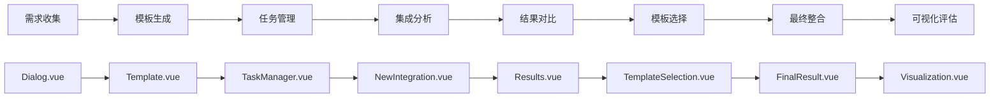

# AI驱动的智能工作流程管理系统

一个基于 Vue 3 + TypeScript + Node.js + MySQL 的智能工作流程管理平台，集成 AI 对话、任务管理、流程分析、评估可视化与 PDF 报告。

## 🚀 项目概览

平台支持以自然语言与 AI 交互完成需求分析，自动生成与管理多任务，按八步流程进行分析、方案生成与效果评估。

### 关键特性
- 🤖 智能对话：DeepSeek API，流式响应与上下文记忆
- 📋 多任务管理：创建、切换与全程跟踪
- 🔄 八步流程：端到端解决方案生产线
- 📊 可视化分析：雷达图、流程图、历史对比
- 📄 报告生成：一键导出全流程 PDF 报告
- 🔐 安全体系：JWT 认证 + 密码加密
- 💾 数据持久化：MySQL 历史数据可追溯

## 🏗️ 架构与技术栈

### 前端
- Vue 3 + TypeScript、Vue Router 4、Element Plus、ECharts、Vite、html2canvas + jsPDF、marked

### 后端
- Node.js + Express、MySQL 8.0、JWT、bcrypt、CORS

### AI
- OpenAI 兼容接口（服务端转发，默认模型 deepseek-v3 / deepseek-r1）

## 🧭 工作流程



### 步骤说明（简要）
1. Dialog：对话收集需求
2. Template：结构化模板生成
3. TaskManager：三维分析与任务分解
4. NewIntegration：问题识别与筛选
5. Results：双方案生成与比较
6. TemplateSelection：方法对比与评估
7. FinalResult：整合形成实施方案
8. Visualization：评分、雷达图与报告

## ⚙️ 快速开始（Windows）

> 开始前请准备：MySQL 连接信息、JWT 密钥；AI Key 可选（见下方说明）。

### 环境要求
- Node.js ≥ 18（Vite 5 要求）、npm ≥ 8、MySQL ≥ 8.0

### 安装
```powershell
git clone <repository-url>
cd Yuanchuang_Platform
npm install
cd login-backend
npm install
```

### 配置环境变量
- 后端：在 `login-backend/.env` 写入
```env
DB_HOST=localhost
DB_USER=root
DB_PASSWORD=your_mysql_password
PORT=3000
JWT_SECRET=your_jwt_secret_key

# 可选：如果前端不传 Authorization，则建议在服务端配置 AI Key
# 三选一即可：OPENAI_API_KEY / DEEPSEEK_API_KEY / QINIU_OPENAI_KEY
DEEPSEEK_API_KEY=your_api_key
```

- 前端（可选）：在项目根目录 `.env` 写入（仅当你希望由前端携带 Authorization 头）
```env
VITE_API_KEY=your_deepseek_api_key
```

### 初始化数据库
> 说明：后端启动时会自动创建 `user_system` 数据库与相关表（存在则跳过）。如需手动初始化，可参考：

```sql
CREATE DATABASE user_system CHARACTER SET utf8mb4 COLLATE utf8mb4_unicode_ci;
-- 可选：创建用户并授权
CREATE USER 'your_username'@'localhost' IDENTIFIED BY 'your_password';
GRANT ALL PRIVILEGES ON user_system.* TO 'your_username'@'localhost';
FLUSH PRIVILEGES;
```

### 启动
```powershell
# 后端（默认 http://localhost:3000）
cd login-backend
node server.js

# 前端（默认 http://localhost:5173）
cd ..
npm run dev
```

## 🧩 模块概览

- Login.vue：注册/登录、JWT 会话
- Dialog.vue：与 DeepSeek 的实时对话与任务管理
- Template.vue：需求结构化与五要素提取（领域/受众/关键词/语调/提示词）
- TaskManager.vue：三维分析与子任务管理
- NewIntegration.vue：问题识别、优先级与初步方案
- Results.vue：双方案对比与建议
- TemplateSelection.vue：方法论对比与推荐
- FinalResult.vue：最终整合与实施建议、风险评估
- Visualization.vue：四维评分、雷达图与 PDF 报告
- Flowchart.vue：流程导航与进度总览

## 🗄️ 数据库设计

### 主要表
```sql
-- 用户与任务
users
dialog_tasks

-- 对话与内容
conversations
ai_content            -- Template 阶段内容

-- 分析与方案
task_manager_content
new_integration_analysis
results_solutions
template_selection
final_result_expanded

-- 评估与可视化
visualization_assessments
```

### 关系
- 用户 → 任务：一对多
- 任务 → 内容阶段：一对多
- 最终内容 → 评估：一对一

## 🔌 核心 API（摘要）

### 用户认证
```
POST /api/register
POST /api/login
```

### 任务管理
```
GET    /api/dialog-tasks/:userId
POST   /api/dialog-tasks
PUT    /api/dialog-tasks/active
DELETE /api/dialog-tasks/:taskId

# 兼容按任务名删除
DELETE /api/tasks/by-name/:taskName
```

### 对话与内容
```
POST /api/dialog-messages
GET  /api/dialog-messages/:userId/:taskName
PUT  /api/dialog-messages/:messageDbId

POST /api/save-content
PUT  /api/update-content
GET  /api/ai-content/:taskName

GET  /api/task-manager-content/:taskName
```

### 分析与评估
```
POST /api/save-integration-analysis
GET  /api/integration-analysis/:taskName

POST /api/save-results
GET  /api/results-solutions/:taskName

POST /api/template-selection/save
GET  /api/template-selection/:taskName

POST /api/final-result-expanded/save
GET  /api/final-result-expanded/:taskName

POST /api/executable-plan/save
GET  /api/executable-plan/:taskName

POST /api/save-visualization-assessment
GET  /api/visualization-assessments
```

### AI 代理（与子任务/问题分析）
```
POST /api/ai                       # 非流式：一次性返回
POST /api/combined-plan/stream     # SSE：流式转发

POST /api/ai/decompose-subtasks
POST /api/ai/analyze-task-problems

POST /api/sub-tasks/batch
GET  /api/sub-tasks/:taskName

POST /api/task-problems/batch
GET  /api/task-problems/:taskName
PUT  /api/task-problems/selection
```

## 🔧 开发指南

### 代码与实践
- Vue 3 Composition API + TypeScript
- Element Plus 统一 UI 与交互
- RESTful API、JWT 认证、错误与日志
- 合理的表结构/索引，约束保证一致性

### Utils / Loading Helper（简洁用法）
- 位置：`src/utils/loadingHelper.ts`
- 功能：统一管理 Loading 状态与 Element Plus `v-loading` 配置

示例：
```vue
<template>
  <div v-loading="isLoading" v-bind="loadingProps">
    <!-- 内容 -->
  </div>
  <el-button :disabled="isLoading" @click="run">执行</el-button>
  
  </template>
<script setup lang="ts">
import { useLoading, defaultLoadingConfig, getLoadingProps } from '@/utils'
const { isGenerating: isLoading, startGenerating, stopGenerating } = useLoading()
const loadingProps = getLoadingProps(defaultLoadingConfig)
async function run() { try { startGenerating(); /* ... */ } finally { stopGenerating() } }
</script>
```

## 🔍 故障排除

### 环境变量缺失
```
Error: 缺少必要的环境变量
```
解决：检查 `login-backend/.env` 与 项目根 `.env`，确认密钥有效并重启服务。

### 数据库连接失败
```
Error: connect ECONNREFUSED 127.0.0.1:3306
```
解决：确认 MySQL 已启动、配置正确且权限充分。

### AI API 401
```
Error: 401 Unauthorized
```
解决：校验 DeepSeek API Key 与网络连通性。

### 前端路由 404
```
Cannot GET /some-route
```
解决：检查路由定义与组件路径，必要时添加回退路由。

### PDF 生成失败
```
html2canvas error
```
解决：等待资源加载完成、检查浏览器兼容并精简复杂 DOM。

### PowerShell 执行策略导致 npm 脚本无法运行（Windows）
```powershell
Set-ExecutionPolicy -Scope CurrentUser -ExecutionPolicy RemoteSigned
```
执行后重启终端再运行 `npm run dev`。

## 📦 项目结构（简）
```
Yuanchuang_Platform/
├── src/
│   ├── components/
│   ├── views/
│   ├── router/
│   └── main.ts
├── login-backend/
├── public/
└── package.json
```

## 🤝 贡献指南

### 流程
1. Fork 仓库并创建分支（`feature/xxx`）
2. 提交更改（语义化提交）
3. 发起 Pull Request

### 规范
- ESLint + Prettier、TypeScript 注解
- 提交类型：feat/fix/docs/style/refactor/test/chore

## 📄 许可证

MIT License，详见 [LICENSE](LICENSE)。

## 📞 技术支持

- GitHub Issues：<https://github.com/aa1412666/-.git/issues>
- 仓库地址：<https://github.com/aa1412666/-.git>

---

项目版本：以 package.json 为准  
最后更新：2025-12-15  
维护状态：积极维护中

致谢：感谢所有贡献者与社区成员！
