# AI驱动的智能工作流程管理系统

一个基于Vue 3 + TypeScript + Node.js + MySQL的现代化智能工作流程管理平台，集成了AI对话、任务管理、流程分析、可视化评估和PDF报告生成等企业级功能。

## 🚀 项目概述

本系统是一个完整的AI驱动工作流程管理平台，支持用户通过自然语言与AI交互进行需求分析，自动生成和管理多任务，并通过完整的工作流程进行深度分析、解决方案生成和效果评估。

### 核心特性

- 🤖 **智能AI对话**：集成DeepSeek API，支持流式响应和自然语言交互
- 📋 **多任务并发管理**：支持创建、切换和管理多个独立工作任务
- 🔄 **完整工作流程**：八步骤端到端解决方案生成流程
- 📊 **可视化分析**：雷达图评估、流程图导航和数据可视化
- � **智能报告生成**：自动生成包含全流程数据的PDF报告
- �🔐 **企业级安全**：JWT认证、密码加密和用户权限管理
- 💾 **数据持久化**：MySQL数据库存储，支持历史数据回溯
- 🎯 **实时协作**：多用户支持和任务数据共享

## 🏗️ 技术架构

### 前端技术栈
- **Vue 3** + **TypeScript** - 现代化前端框架和类型安全
- **Vue Router 4** - 单页面应用路由管理
- **Element Plus** - 企业级UI组件库
- **ECharts** - 专业数据可视化图表
- **html2canvas** + **jsPDF** - PDF报告生成
- **marked** - Markdown渲染支持
- **Vite** - 极速构建工具

### 后端技术栈
- **Node.js** + **Express** - 高性能服务器端运行环境
- **MySQL 8.0** - 关系型数据库，支持复杂查询
- **JWT** - 安全的用户认证和会话管理
- **bcrypt** - 密码哈希加密
- **CORS** - 跨域资源共享支持

### AI集成
- **DeepSeek API** - 先进的大语言模型API
- **流式响应处理** - 实时AI对话体验
- **上下文管理** - 多轮对话记忆机制

## 📋 功能模块详解

### 1. 用户认证系统 (Login.vue)
- **用户注册/登录**：安全的账户管理系统
- **JWT Token认证**：无状态会话管理
- **密码安全**：bcrypt加密存储
- **自动登录**：Token自动续期机制

### 2. AI智能对话 (Dialog.vue)
- **多任务并发**：支持创建和切换多个对话任务
- **实时AI交互**：与DeepSeek AI进行自然语言对话
- **对话历史管理**：完整的消息记录和恢复
- **任务生命周期**：从创建到完成的全程跟踪
- **语音输入支持**：多模态交互体验

### 3. 智能模板生成 (Template.vue)
- **需求结构化**：将自然语言需求转换为结构化模板
- **五要素提取**：
  - **领域 (Area)**：问题所属领域分析
  - **受众 (Audience)**：目标用户群体识别  
  - **关键词 (Keywords)**：核心概念提取
  - **语调 (Tone)**：内容风格定义
  - **提示词 (Prompt)**：AI交互优化
- **模板自动生成**：基于提取要素生成工作模板

### 4. 任务管理器 (TaskManager.vue)
- **三维分析框架**：
  - **主演化（趋势分析）**：发展趋势和演化路径
  - **主系统（九宫格+因果分析）**：系统性问题分析
  - **主作用（FOP分析）**：功能导向分析
- **子任务动态管理**：支持添加、编辑和删除子任务
- **AI辅助分析**：智能生成任务分解建议
- **进度可视化**：实时任务状态跟踪

### 5. 新集成分析 (NewIntegration.vue)
- **智能问题识别**：AI自动分析并识别潜在问题点
- **问题优先级排序**：基于重要性和紧急性排序
- **用户问题筛选**：交互式问题选择机制
- **初步解决方案**：基于选定问题生成解决思路

### 6. 结果方案对比 (Results.vue)
- **双方案生成**：AI生成两种不同解决方案
- **方案详细分析**：优缺点、可行性、成本效益分析
- **对比可视化**：方案特性对比表格
- **智能推荐**：基于评估指标的方案推荐

### 7. 模板选择对比 (TemplateSelection.vue)
- **创新方法对比**：不同创新方法的详细比较
- **方案内容分析**：左右两栏对比展示
- **方法论评估**：各种创新方法的适用性分析
- **最佳实践推荐**：基于历史数据的方法推荐

### 8. 最终结果整合 (FinalResult.vue)
- **方案最终确定**：基于前期分析确定最终方案
- **完整技术方案**：AI整合生成完整的技术实施方案
- **实施建议**：具体的执行步骤和注意事项
- **风险评估**：潜在风险识别和缓解措施

### 9. 可视化评估 (Visualization.vue)
- **四维AI评分系统**：
  - **准确性 (Accuracy)**：方案的准确度评估
  - **清晰度 (Clarity)**：表达的清晰程度
  - **可解释性 (Interpretability)**：方案的可理解性
  - **创新性 (Innovation)**：创新程度评估
- **雷达图可视化**：直观的评分结果展示
- **历史对比分析**：多次评估结果的趋势分析
- **智能PDF报告**：自动生成包含全流程数据的专业报告

### 10. 流程图导航 (Flowchart.vue)
- **完整流程可视化**：八步工作流程的图形化展示
- **节点状态追踪**：实时显示各节点完成状态
- **数据统计面板**：各模块数据量统计
- **快速导航**：点击节点快速跳转到对应页面
- **任务进度总览**：整体项目进度一目了然

## � 完整工作流程

```mermaid
graph LR
    A[需求收集] --> B[模板生成]
    B --> C[任务管理]
    C --> D[集成分析]
    D --> E[结果对比]
    E --> F[模板选择]
    F --> G[最终整合]
    G --> H[可视化评估]
    
    A1[Dialog.vue] --> B1[Template.vue]
    B1 --> C1[TaskManager.vue]
    C1 --> D1[NewIntegration.vue]
    D1 --> E1[Results.vue]
    E1 --> F1[TemplateSelection.vue]
    F1 --> G1[FinalResult.vue]
    G1 --> H1[Visualization.vue]
```



### 详细流程说明

1. **需求收集阶段 (Dialog)**：用户与AI对话，描述需求和问题背景
2. **模板生成阶段 (Template)**：AI分析对话内容，生成结构化需求模板
3. **任务管理阶段 (TaskManager)**：展示三维分析结果，支持任务分解
4. **集成分析阶段 (NewIntegration)**：AI识别问题，用户筛选关键问题
5. **结果对比阶段 (Results)**：生成并对比两种解决方案
6. **模板选择阶段 (TemplateSelection)**：比较不同创新方法的适用性
7. **最终整合阶段 (FinalResult)**：确定最终方案并生成完整技术方案
8. **效果评估阶段 (Visualization)**：四维评分和PDF报告生成

## 🗄️ 数据库设计

### 核心数据表

```sql
-- 用户管理
users                           -- 用户信息表
dialog_tasks                    -- 对话任务表

-- 对话与内容
conversations                   -- 对话记录表
ai_content                      -- AI生成内容表 (Template)

-- 任务与分析
task_manager_content           -- 任务管理内容表
new_integration_analysis       -- 新集成分析表
results_solutions             -- 结果方案表
template_selection            -- 模板选择对比表
final_result_expanded         -- 最终结果表

-- 评估与可视化
visualization_assessments     -- 可视化评估表
```

### 数据关系设计
- **用户 -> 任务**：一对多关系，支持多任务管理
- **任务 -> 内容**：一对多关系，同一任务的不同阶段内容
- **内容 -> 评估**：一对一关系，每个最终方案对应一个评估

## 🚀 快速开始

> **📋 配置前须知**  
> 本项目需要您自己提供以下配置：
> - MySQL数据库连接信息
> - DeepSeek AI API密钥  
> - JWT密钥（用于用户认证）
> 
> 请在开始之前准备好这些配置信息。

### 环境要求
- **Node.js** >= 16.0.0
- **MySQL** >= 8.0
- **npm** >= 7.0.0

### 安装与配置

1. **克隆项目**
```bash
git clone <repository-url>
cd AI-WorkFlow-Manager
```

2. **安装前端依赖**
```bash
npm install
```

3. **安装后端依赖**
```bash
cd login-backend
npm install
```

4. **配置环境变量**

⚠️ **重要提示**：以下环境变量需要您自己提供和配置

**后端环境变量配置**：
在 `login-backend` 目录下创建 `.env` 文件：
```env
# 数据库配置（需要您自己提供MySQL数据库信息）
DB_HOST=localhost
DB_USER=root
DB_PASSWORD=your_mysql_password  # 替换为您的MySQL密码
DB_NAME=user_system             # 数据库名称
PORT=3000

# 安全配置（请生成您自己的密钥）
JWT_SECRET=your_jwt_secret_key  # 替换为您的JWT密钥
```

**前端环境变量配置**：
在项目根目录下创建 `.env` 文件：
```env
# AI API配置（需要您自己申请API密钥）
VITE_API_KEY=your_deepseek_api_key        # DeepSeek API密钥
DASHSCOPE_API_KEY=your_dashscope_api_key  # 阿里云灵积API密钥（可选）
TAVILY_API_KEY=your_tavily_api_key        # Tavily搜索API密钥（可选）
```

**如何获取API密钥**：
- **DeepSeek API**：访问 [DeepSeek官网](https://platform.deepseek.com/) 注册并获取API密钥
- **阿里云灵积**：访问 [阿里云灵积平台](https://dashscope.aliyun.com/) 申请API密钥
- **Tavily搜索**：访问 [Tavily官网](https://tavily.com/) 申请搜索API密钥

**配置文件位置**：
```
项目根目录/
├── .env                    # 前端环境变量（AI API配置）
├── login-backend/
│   └── .env               # 后端环境变量（数据库和JWT配置）
└── ...
```

5. **启动MySQL并创建数据库**

⚠️ **注意**：请确保您已经安装并启动了MySQL 8.0+

```sql
-- 请使用您自己的MySQL连接信息
CREATE DATABASE user_system CHARACTER SET utf8mb4 COLLATE utf8mb4_unicode_ci;

-- 如果需要创建新用户（可选）
CREATE USER 'your_username'@'localhost' IDENTIFIED BY 'your_password';
GRANT ALL PRIVILEGES ON user_system.* TO 'your_username'@'localhost';
FLUSH PRIVILEGES;
```

**数据库配置说明**：
- 数据库会在首次启动后端服务时自动创建所需的表结构
- 请确保 `.env` 文件中的数据库配置与您的MySQL设置一致

6. **启动后端服务**
```bash
cd login-backend
node server.js
```
后端服务将在 `http://localhost:3000` 启动

7. **启动前端开发服务器**
```bash
cd ..
npm run dev
```
前端应用将在 `http://localhost:5173` 启动

## 📱 使用指南

### 首次使用流程

1. **账户注册**：访问系统，点击注册创建新账户
2. **登录系统**：使用注册的凭据登录
3. **创建首个任务**：在Dialog页面点击"新建任务"
4. **AI需求对话**：详细描述您的需求和问题
5. **跟随工作流程**：按照系统引导完成八步流程
6. **生成最终报告**：在Visualization页面生成PDF报告

### 高级功能使用

#### 多任务管理
- **并发处理**：同时管理多个独立项目
- **任务切换**：侧边栏快速切换不同任务
- **进度跟踪**：Flowchart页面查看所有任务进度
- **历史回溯**：查看和恢复历史任务数据

#### 报告生成
- **全流程数据**：包含对话、分析、方案等所有数据
- **可视化图表**：雷达图、流程图等图表内容
- **专业排版**：自动生成目录、页码、章节标题
- **多格式支持**：PDF格式，支持打印和分享

#### 数据分析
- **任务统计**：各阶段数据量和完成度统计
- **趋势分析**：历史数据趋势和模式识别
- **效果评估**：四维评分和综合评估报告

## 🔧 开发指南

### Utils工具库

项目提供了一套完整的工具函数库，位于 `src/utils/` 目录下，提供可复用的功能模块。

#### Loading Helper 工具 (`loadingHelper.ts`)

提供统一的Loading状态管理和Element Plus Loading组件的配置。

**主要功能：**

1. **Loading状态管理 (`useLoading`)**

提供了一套完整的Loading状态管理hooks：

```typescript
import { useLoading } from '@/utils'

export default {
  setup() {
    const {
      isRethinking,      // 重新思考状态
      isSubmitting,      // 提交状态  
      isGenerating,      // 生成状态
      isLoading,         // 任何加载状态的计算属性
      startRethinking,   // 开始重新思考
      stopRethinking,    // 停止重新思考
      startSubmitting,   // 开始提交
      stopSubmitting,    // 停止提交
      startGenerating,   // 开始生成
      stopGenerating,    // 停止生成
      stopAllLoading,    // 停止所有加载状态
      getButtonText      // 获取按钮文本助手
    } = useLoading()

    return {
      isLoading,
      startRethinking,
      stopRethinking,
      // ... 其他需要的状态和方法
    }
  }
}
```

2. **Loading配置 (`getLoadingProps`)**

提供预设的Loading配置：

```typescript
import { defaultLoadingConfig, getLoadingProps } from '@/utils'

// 获取默认Loading配置
const loadingProps = getLoadingProps(defaultLoadingConfig)

// 在模板中使用
<div v-loading="isLoading" v-bind="loadingProps">
  <!-- 内容 -->
</div>
```

3. **预设配置**

- `defaultLoadingConfig`: 默认配置
- `aiThinkingLoadingConfig`: AI思考专用配置
- `formSubmitLoadingConfig`: 表单提交专用配置

**使用示例：**

```vue
<template>
  <form v-loading="isLoading" v-bind="loadingProps">
    <button @click="rethink" :disabled="isLoading">
      {{ getButtonText('思考', '正在生成...', isRethinking) }}
    </button>
    <button @click="handleSubmit" :disabled="isLoading">
      {{ getButtonText('下一步', '正在处理...', isSubmitting) }}
    </button>
  </form>
</template>

<script>
import { useLoading, defaultLoadingConfig, getLoadingProps } from '@/utils'

export default {
  setup() {
    const {
      isRethinking,
      isSubmitting, 
      isLoading,
      startRethinking,
      stopRethinking,
      startSubmitting,
      stopSubmitting,
      getButtonText
    } = useLoading()

    const loadingProps = getLoadingProps(defaultLoadingConfig)

    return {
      isLoading,
      isRethinking,
      isSubmitting,
      startRethinking,
      stopRethinking,
      startSubmitting,
      stopSubmitting,
      getButtonText,
      loadingProps
    }
  },
  methods: {
    async rethink() {
      try {
        this.startRethinking()
        // 执行异步操作
        await this.performRethink()
      } finally {
        this.stopRethinking()
      }
    },
    
    async handleSubmit() {
      try {
        this.startSubmitting()
        // 执行提交操作
        await this.performSubmit()
      } finally {
        this.stopSubmitting()
      }
    }
  }
}
</script>
```

**在其他组件中复用：**

任何需要Loading状态的组件都可以直接导入使用：

```typescript
// 在其他Vue组件中
import { useLoading, aiThinkingLoadingConfig, getLoadingProps } from '@/utils'

export default {
  setup() {
    const { isLoading, startGenerating, stopGenerating } = useLoading()
    const loadingProps = getLoadingProps(aiThinkingLoadingConfig)
    
    return { isLoading, startGenerating, stopGenerating, loadingProps }
  }
}
```

**扩展自定义Loading状态：**

如果需要新的Loading状态，可以直接在`useLoading`中添加：

```typescript
export function useLoading() {
  const isCustomOperation = ref(false)
  
  const startCustomOperation = () => {
    isCustomOperation.value = true
  }
  
  const stopCustomOperation = () => {
    isCustomOperation.value = false
  }
  
  return {
    // 现有的状态和方法...
    isCustomOperation,
    startCustomOperation,
    stopCustomOperation
  }
}
```

### 项目结构
```
AI-WorkFlow-Manager/
├── src/
│   ├── components/              # 公共组件
│   │   ├── breadcrumb.vue      # 面包屑导航
│   │   ├── navbar.vue          # 顶部导航栏
│   │   └── footers.vue         # 页脚组件
│   ├── views/                  # 页面组件
│   │   ├── Login.vue           # 登录注册页面
│   │   ├── Dialog.vue          # AI对话页面
│   │   ├── Template.vue        # 模板生成页面
│   │   ├── TaskManager.vue     # 任务管理页面
│   │   ├── NewIntegration.vue  # 新集成分析页面
│   │   ├── Results.vue         # 结果对比页面
│   │   ├── TemplateSelection.vue # 模板选择页面
│   │   ├── FinalResult.vue     # 最终结果页面
│   │   ├── Visualization.vue   # 可视化评估页面
│   │   └── Flowchart.vue       # 流程图导航页面
│   ├── router/                 # 路由配置
│   │   └── index.js           # 路由定义
│   ├── assets/                # 静态资源
│   │   └── fonts/             # 字体文件
│   └── main.ts                # 应用入口
├── login-backend/              # 后端服务
│   ├── server.js              # 服务器主文件
│   └── package.json           # 后端依赖
├── public/                    # 公共静态资源
└── package.json              # 前端依赖
```

### 核心API接口

#### 用户认证
```javascript
POST /api/register             // 用户注册
POST /api/login               // 用户登录
```

#### 任务管理
```javascript
GET /api/dialog-tasks/:userId        // 获取用户任务列表
POST /api/dialog-tasks              // 创建新任务
PUT /api/dialog-tasks/active        // 设置活跃任务
DELETE /api/dialog-tasks/:taskId    // 删除任务
```

#### 对话管理
```javascript
POST /api/dialog-messages                    // 保存对话消息
GET /api/dialog-messages/:userId/:taskName  // 获取任务对话历史
```

#### 内容管理
```javascript
POST /api/save-content                    // 保存AI生成内容
GET /api/ai-content/:taskName            // 获取任务相关内容
POST /api/task-manager-content          // 保存任务管理内容
GET /api/task-manager-content/:taskName // 获取任务管理内容
```

#### 分析与评估
```javascript
POST /api/integration-analysis                    // 保存集成分析
GET /api/integration-analysis/:taskName          // 获取集成分析
POST /api/results-solutions                      // 保存结果方案
GET /api/results-solutions/:taskName             // 获取结果方案
POST /api/save-visualization-assessment          // 保存可视化评估
GET /api/visualization-assessments              // 获取评估历史
```

### 开发最佳实践

#### 前端开发
- 使用Vue 3 Composition API进行组件开发
- TypeScript类型安全，减少运行时错误
- Element Plus组件库保持UI一致性
- 合理使用响应式数据和计算属性
- 组件间通信优先使用props和events

#### 后端开发
- RESTful API设计规范
- JWT Token安全认证
- 数据库连接池优化性能
- 错误处理和日志记录
- API接口文档维护

#### 数据库设计
- 合理的表结构和索引设计
- 外键约束保证数据完整性
- 定期备份和恢复策略
- 查询性能优化

## 🔍 故障排除

### 常见问题及解决方案

#### 0. 环境变量配置问题
```bash
Error: 缺少必要的环境变量
```
**解决方案**：
- 检查 `login-backend/.env` 文件是否存在且包含所有必要配置
- 检查项目根目录 `.env` 文件是否包含AI API密钥
- 确认所有API密钥都已正确设置且有效
- 重启服务以使环境变量生效

#### 1. 数据库连接问题
```bash
Error: connect ECONNREFUSED 127.0.0.1:3306
```
**解决方案**：
- 检查MySQL服务是否启动
- 验证.env文件中的数据库配置
- 确认数据库用户权限

#### 2. AI API调用失败
```bash
Error: 401 Unauthorized
```
**解决方案**：
- 检查DEEPSEEK_API_KEY是否正确配置
- 验证API密钥是否有效
- 确认网络连接正常

#### 3. 前端路由问题
```bash
Cannot GET /some-route
```
**解决方案**：
- 检查路由配置是否正确
- 确认组件导入路径
- 验证路由守卫配置

#### 4. PDF生成失败
```bash
html2canvas error
```
**解决方案**：
- 检查浏览器兼容性
- 确认图片资源加载完成
- 优化DOM结构和CSS样式

### 性能优化建议

1. **前端性能**：
   - 使用Vue3的按需加载
   - 图片懒加载和压缩
   - 合理使用缓存策略

2. **后端性能**：
   - 数据库查询优化
   - API响应缓存
   - 连接池配置优化

3. **网络性能**：
   - 启用gzip压缩
   - CDN加速静态资源
   - HTTP/2协议支持

## 🤝 贡献指南

### 开发流程
1. Fork项目到个人仓库
2. 创建功能分支 (`git checkout -b feature/AmazingFeature`)
3. 提交更改 (`git commit -m 'Add some AmazingFeature'`)
4. 推送分支 (`git push origin feature/AmazingFeature`)
5. 创建Pull Request

### 代码规范
- 遵循ESLint和Prettier配置
- 使用TypeScript类型注解
- 编写清晰的注释和文档
- 单元测试覆盖核心功能

### 提交规范
- feat: 新功能
- fix: 修复bug
- docs: 文档更新
- style: 代码格式调整
- refactor: 代码重构
- test: 测试相关
- chore: 构建过程或辅助工具的变动

## 📄 许可证

本项目采用 MIT 许可证 - 查看 [LICENSE](LICENSE) 文件了解详情。

## 📞 技术支持

### 联系方式
- **GitHub Issues**：[提交问题](https://github.com/aa1412666/-.git/issues)
- **GitHub仓库**：[项目地址](https://github.com/aa1412666/-.git)

### 社区支持
- 加入我们的技术交流群
- 关注项目更新和最佳实践分享
- 参与开源贡献和代码审查

---

**项目版本**：v2.0.0  
**最后更新**：2025年9月7日  
**维护状态**：积极维护中

💡 **致谢**：感谢所有贡献者和社区成员的支持与反馈！
